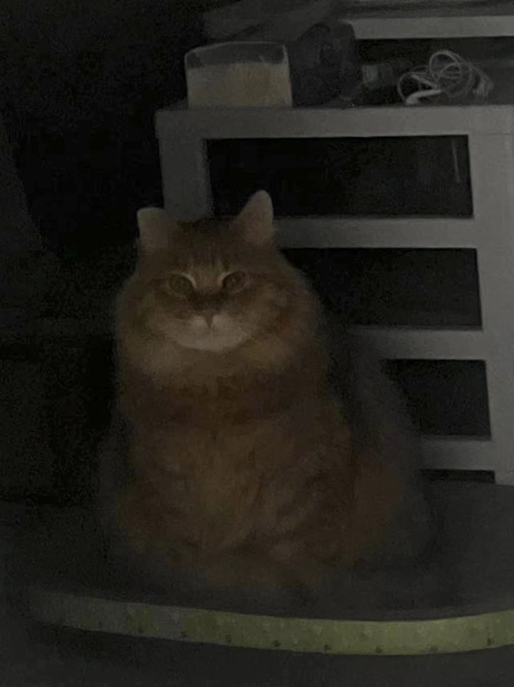

# Dog Cat Detection with YOLOv5

Simple project that applied YOLOv5 in detection of dogs cats. See the [YOLOv5 Docs](https://docs.ultralytics.com/yolov5) for full documentation on training, testing and deployment.

## Environment and Dependencies
- Python 3.8

Install requirements
```bash
pip install -r requirements.txt
```

## Data
- Data used for this project can be found [here.](https://www.kaggle.com/datasets/andrewmvd/dog-and-cat-detection)

## Training
```bash
python train.py
```
the results are stored in ./runs/train/exp

Training results on valid set: 

Metrics:


## detect
`detect.py` runs inference on a variety of sources.
```bash
python detect.py  --source [path-to-file] 
```

| Input Image | Result Image |
| --- | --- |
|  |  |
|  |  |

## Result analysis
YOLOv5 is a deep learning-based object detection model that is capable of recognizing and locating multiple objects within an image. When detecting cat faces, frontal and profile (side) views may be detected differently due to several factors:

1. **Feature Differences**: Frontal and profile views present significantly different visual features. The frontal view offers symmetrical facial features like two eyes, a nose, and a mouth, while the profile view shows the side contour of the face. The model might have learned a specific set of features during training that do not present the same in frontal and profile views.

2. **Training Data**: If the training dataset used to train YOLOv5 had more images of frontal faces than profile views, the model would be more accurate in detecting frontal faces. This could result in less accurate detection of profile views.

3. **Pose Variations**: The orientation or pose of a cat's face can greatly affect the performance of a detection model. Profile views may lead to occlusion of key features, making it difficult for the model to recognize accurately.

4. **Model Generalization**: The generalization ability of a deep learning model refers to its performance on unseen data. If the model hasn’t seen enough profile view samples during training to learn how to recognize cat faces from various angles, it might have weaker generalization for profile views.

5. **Bounding Box Regression**: YOLOv5 needs to perform bounding box regression to determine the location and size of the target. The shape and dimensions of profile views might differ from frontal faces, complicating accurate bounding box regression.

To improve the detection accuracy of profile views, the following measures can be taken:
- **Data Augmentation**: Increase the number of profile view images in the training dataset or use data augmentation techniques to simulate different angles and poses.
- **Model Fine-tuning**: Fine-tune the model with a dataset that includes a significant number of profile view images to enhance the model's ability to recognize profile views.
- **Multi-angle Training**: Ensure the training dataset covers cat faces from various angles so that the model can learn a more robust feature representation.

## Reference 
- [YOLOv5](https://github.com/ultralytics/yolov5)
- [Chinese Guide](https://blog.csdn.net/oJiWuXuan/article/details/107558286)